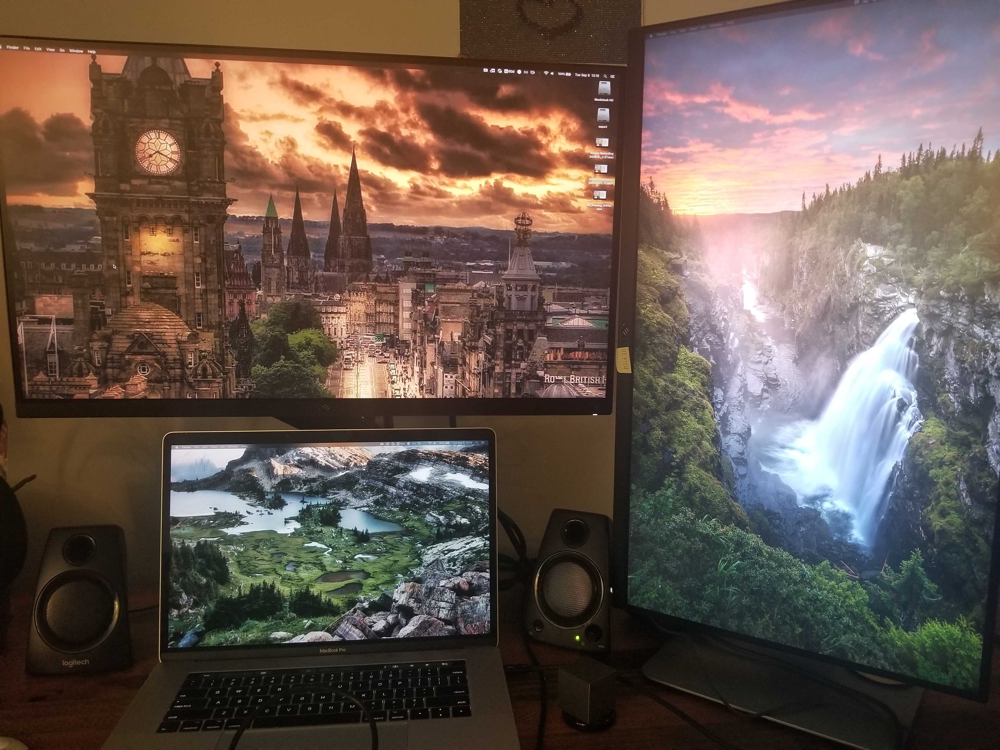

> [!WARNING]
> 2026-08-22: This app currently breaks as Reddit has locked down their API. I've applied for an API key (hopefully they'll grant me access), but you'll probably have to apply for your own to use Grabbit.

# Grabbit

A small single-binary CLI to grab images from Reddit - I've been surprised how much I enjoy seeing beautiful wallpapers when I lock/unlock my computer. grabbit automatically skips images tagged NSFW, designed to be easy to install/uninstall and is [MIT licensed](./LICENSE).

## @bbkane's Setup

See my [personal config](https://github.com/bbkane/dotfiles/blob/master/grabbit/dot-config/grabbit.yaml):



I run grabbit on a weekly schedule automatically. Here's how I do that:

- [Mac](https://github.com/bbkane/dotfiles/tree/master/grabbit-launchctl)
- [Linux](https://github.com/bbkane/dotfiles/tree/master/grabbit-systemd)

## Project Status (2025-06-14)

Basically complete! I use `grabbit` for wallpapers. At some point I'd like to use OTEL tracing instead of the current logging framework, but that's not a huge deal. I'm watching issues; please open one for any questions and especially BEFORE submitting a Pull request.

## Install

- [Homebrew](https://brew.sh/): `brew install --cask bbkane/tap/grabbit`
- [Scoop](https://scoop.sh/):

```
scoop bucket add bbkane https://github.com/bbkane/scoop-bucket
scoop install bbkane/grabbit
```

- Download Mac/Linux/Windows executable: [GitHub releases](https://github.com/bbkane/grabbit/releases)
- Go: `go install go.bbkane.com/grabbit/v5@latest`
- Build with [goreleaser](https://goreleaser.com/) after cloning: `goreleaser release --snapshot --clean`

## Use

```bash
# Grab from passed flags
grabbit grab \
    --destination . \
    --subreddit-info wallpapers,day,5 \
    --subreddit-info earthporn,week,10

# Create/Edit config file
grabbit config edit --editor /path/to/editor

# Grab from config file
grabbit grab
```

## See current wallpapers

On macOS, I use the followng command to see what wallpapers (and any other open files) my desktop is using:

```bash
lsof -c WallpaperImageExtension
```

I can run a similar command in XFCE:

```bash
xfconf-query -c xfce4-desktop -l \
| grep last-image \
| while read -r property; do xfconf-query -c xfce4-desktop -p "$property"; done \
| sort -u
```

## Docs

- Hack on grabbit: [./dev_notes.md](./dev_notes.md)
- See [Go Project Notes](https://www.bbkane.com/blog/go-project-notes/) for notes on development tooling.
- [MIT Licensed](./LICENSE)

## 3rd Party Credits

- library authors: see [./go.mod](./go.mod)
- inspiration: [reddit_get_top_images](https://github.com/nagracks/reddit_get_top_images)
