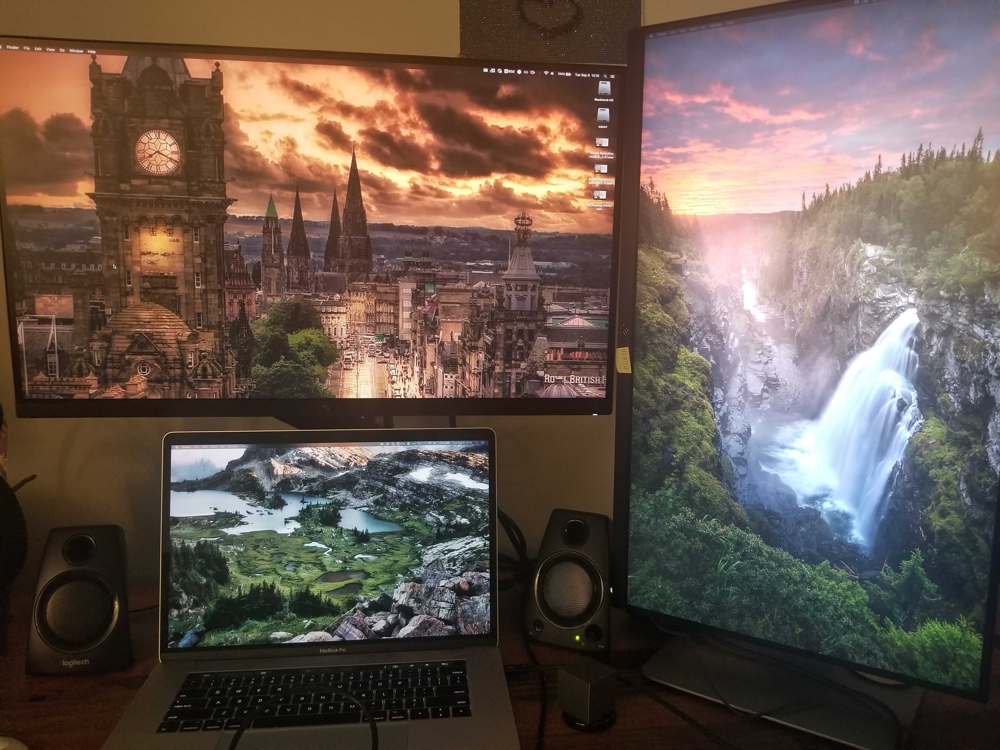

# Grabbit

Grab subreddit images!! Very useful for getting nice wallpapers automatically.

## @bbkane's Setup

See my [personal config](https://github.com/bbkane/dotfiles/blob/master/grabbit/.config/grabbit.yaml).



# Install

## MacOS Homebrew

```
brew install bbkane/tap/grabbit
```

## Download

Download from https://github.com/bbkane/grabbit/releases

# Run grabbit on a schedule

See [./schedule_it.md](./schedule_it.md)

# Credits

- library authors - see [./go.mod](./go.mod)
- [reddit_get_top_images](https://github.com/nagracks/reddit_get_top_images)
